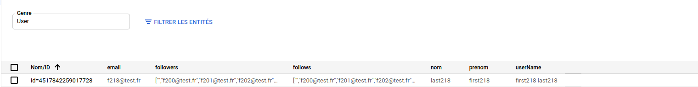
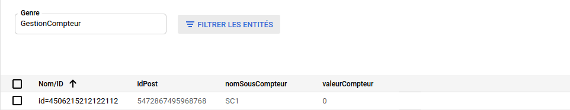
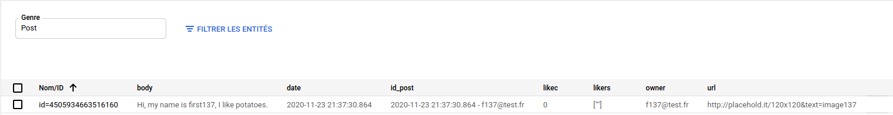
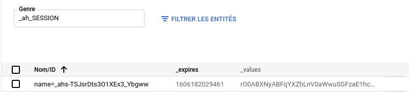

Projet TinyGram - Clément Picard ~ Sylouan Corfa ~ Jules Roger ~ Kader Salifou
==================

Application Instagram-like propulsée par Google App Engine

    url App Engine : https://tinyinsta-295119.appspot.com/
    url GitHub : https://github.com/Taraal/TinyInsta
    url interface REST : https://endpointsportal.tinyinsta-295119.cloud.goog/

## Objectifs

Le but de ce projet était de réaliser une version réduite d'un application comme Instagram. Il nous fallait pour cela répondre à certaines contraintes Tout d'abord, il fallait rendre l'application fonctionnelle selon certains critères.

- [x] Authentification d'un utilisateur par son compte Google
- [x] Créer un post (avec ou sans photo associée) lié à l'utilisateur connecté
- [x] Lister les posts des utilisateurs que le user follow
- [x] Checher d'autres utilisateurs inscrits sur le site 
- [x] Follow un autre utilisateur
- [x] Like / Dislike un post
- [x] Créer une interface graphique

## Does it scale?

Outre le fait de rendre l'application fonctionnelle, il nous a fallu travailler sur le scaling. En effet, pour créer une application viable, il est important de la programmer de sorte à ce que le nombre d'utilisateurs n'influe pas ou peu sur les temps de réponse du site. Il faut que cela scale ! Nous avons pour cela mis au point des fonctions de benchmark permettant de tester notre TinyGram. Le code nécessaire pour générer ces résultats est disponible à la fin du fichier ScoreEndpoint.

- Test du temps nécessaire pour créer un post. Pour éviter le fan-out problem et offrir la possibilité de poster à des millions de personnes, nous avons choisi de déconnecter le post des followers. Ainsi, le nombre de followers n'a pas d'impact sur le temps de création d'un post. On obtient finalement des résultats, moyennés sur 30 mesures, qui montrent une constance et une indépendance au nombre de followers. Pour vérifier ces résultats, utilisez user10@test.fr, user100@test.fr et u500@test.fr dans la fonction correspondante.
        
        - si on est follow par 10 users : 323 ms/post
        
        - si on est follow par 100 users : 321 ms/post
        
        - si on est follow par 500 users : 315 ms/post
        
- Combien de likes peut on faire par seconde. Afin de faire face au problème de contention, nous avons créé 10 sous-compteurs par post. L'objectif est d'éviter que des writes soient réalisés au même instant sur une variable identique (un seul compteur de likes). Pour aller plus loin et rendre la scalability plus poussée, nous aurions souhaité créer une fonction permettant d'ajuster le nombre de sous-compteurs au nombre de followers. En effet, un lot de 10 sous-compteurs semble beaucoup pour des utilisateurs générant 50 likes/post, et une goutte d'eau face aux 100 millions d'utilisateurs de Katy Perry.

        - résultat final : 13,8 likes/sec --> Ce résultat pourrait sûrement être optimisé en générant des likes en paralèle plutôt 
        que dans une boucle for. Le parallélisme simulerait d'ailleurs mieux une situation avec de vrais users.
        
- Combien de temps met l'application à retrouver les posts des comptes que l'utilisateur follow. On fonctionne ici avec un filtre posé sur les dates des posts et sur les noms des followsers. 
        
        - 10 derniers posts : 308 ms
        
        - 100 derniers posts : 3463 ms
        
        - 500 derniers posts : 9632 ms

## Kinds utilisés dans notre appli

### Users

### Sous-compteurs

### Posts

### Sessions

